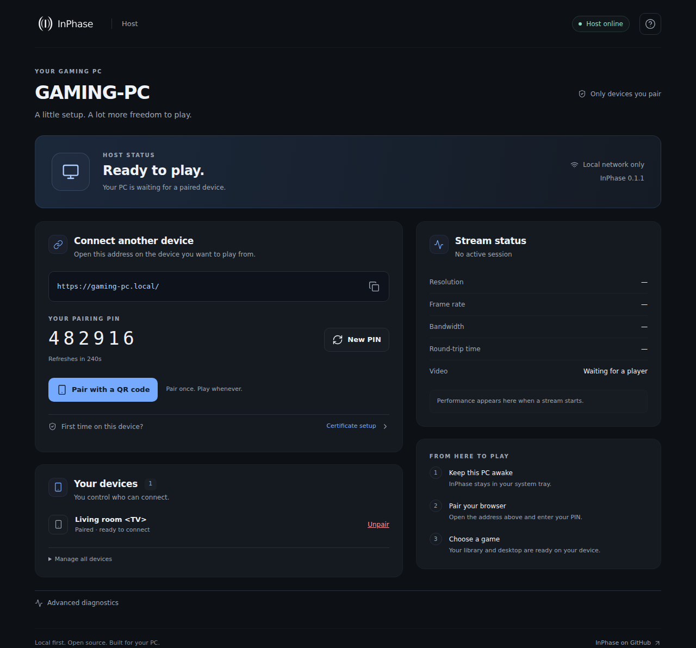
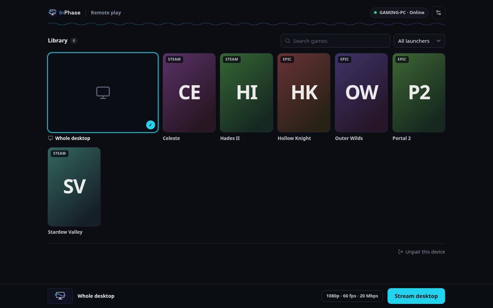

<h1 align="center">
  <picture>
    <source media="(prefers-color-scheme: dark)" srcset="docs/brand/inphase-logo-dark-bg.svg">
    
  </picture>
</h1>

**Your gaming PC, on your other screen.**

InPhase streams a Windows desktop or game to a browser, with hardware video
encoding, game audio, keyboard and mouse input. The host runs in your system tray;
the player runs in your browser. No InPhase account, subscription, or hosted relay.

[Website](https://inphase.sam-bennett.dev) ·
[Download releases](https://github.com/SamBennettDev/InPhase/releases) ·
[Get help](docs/TROUBLESHOOTING.md) · [Contribute](CONTRIBUTING.md)

> **Early access.** Automated checks do not certify real GPU or network playback.
> Check each release's tested hardware and known issues before installing.

## Get started

1. On your gaming PC, download **InPhaseSetup.exe** from a GitHub release's
   **Assets** section. The source-code ZIP is for developers.
2. Run the installer. It includes the host, browser interface, and private
   GStreamer runtime. Windows asks for permission to install and configure the
   firewall. The release notes identify whether the installer is signed.
3. Open **InPhase** from the system tray. The dashboard shows your play address
   and six-digit pairing PIN. Keep the PC awake and signed in.
4. On another device on your home network, follow **Certificate setup** on the
   dashboard, open the play address, and enter the PIN. QR invitations are also
   available; approve the first invited device on the PC when asked.
5. Choose a game or **Whole desktop**, then start the stream. Start with
   **1080p / 60 fps** and adjust Stream settings for your connection.

Use **Ctrl+Shift+Q** to leave a stream. The host emergency stop is
**Ctrl+Alt+Shift+F12**. End streams or revoke devices from the dashboard.

## What you need

| Component | Requirement |
| --- | --- |
| Host | Windows 10 build 19041 or newer, or Windows 11; x64; an active desktop session and display |
| Graphics | A supported hardware encoder and current GPU driver. NVIDIA, AMD, Intel and Media Foundation plugins are bundled; availability depends on hardware and drivers. |
| Player | A current browser with WebTransport and WebCodecs: Chrome, Edge, Firefox, or Safari on macOS and iOS. H.264 decodes everywhere; HEVC where the device decodes it in hardware. |
| Network | A reachable PC on the same trusted LAN. Ethernet on the host is a useful starting point. |
| Controller | Setup offers to install the free ViGEmBus driver (ticked by default, skipped if it is already there). A controller on the player device then appears on the PC as an Xbox 360 controller. |

iPhone Safari renders web pages at 60 Hz by default. For 120 fps, turn off
**Settings → Apps → Safari → Advanced → Feature Flags → Prefer Page Rendering
Updates near 60fps**.

InPhase does not wake a sleeping PC, stream the Windows sign-in/secure desktop,
or guarantee input compatibility with every game or anti-cheat system.
See the [hardware test matrix](tests/compatibility/host-gpu.md).

## Interface

The dashboard brings the play address, PIN, device access, and stream health
together. The player has a searchable game library, launcher filters, saved
quality settings, and layouts for desktop and mobile.




Game discovery reads installed launchers. Cover art comes from local caches first;
optional Steam lookups fill gaps. Set `[library] online_art = false` to disable
those network requests. Unavailable covers use generated title cards.
Screenshots above use test fixtures, not a live streaming session.

## Privacy and access

The host serves its own HTTPS site. Default setup creates a certificate authority
for **your Windows user**; other devices explicitly trust that certificate once.
Only trust certificates from a PC you own. The host identity and CA private key
are protected with Windows DPAPI.

Pairing is local-network-only by default. Administration requires a loopback
connection and loopback Host header; browser origins are checked. Remote access
is **off by default** and needs a suitable network. There is no cloud relay.

- [Security model](docs/lan-security-model.md)
- [Opt-in remote access](docs/ipv6-remote-access.md)
- [Report a vulnerability](SECURITY.md)

**Upgrading from shared-certificate builds:** setup retires the old
`%ProgramData%\InPhase\tls` CA and creates one in your profile. Remove the old
InPhase CA from player devices and follow Certificate setup again.
See [migration notes](docs/TROUBLESHOOTING.md#certificate-migration).

## Build from source

You need Git, the Rust toolchain in `rust-toolchain.toml`, and Node.js **22.12+**
(CI uses Node 24). Windows builds also need Visual Studio C++ Build Tools, the
Windows SDK, **GStreamer 1.28.6 MSVC x64 complete**, and Inno Setup 6.
Review `scripts/provision-windows.ps1` before running it: it installs system tools.

```powershell
git clone https://github.com/SamBennettDev/InPhase.git
cd InPhase
pwsh scripts/build-installer.ps1
# Output: dist/InPhaseSetup.exe
pwsh scripts/verify-package.ps1
```

`scripts/build.ps1 -Release` builds the embedded web client and host together.
`scripts/package.ps1` creates the runtime. Missing DLLs/plugins, failed native
commands, unknown binary licenses, and missing production web assets fail the build.

Linux/macOS can test the protocol, host policy, and web client. Windows capture
and input use stubs there:

```sh
npm --prefix web ci
npm --prefix web test
npm --prefix web run build
cargo fmt --all --check
cargo clippy --locked --workspace --all-targets -- -D warnings
cargo test --locked --workspace
cd web
npx playwright install chromium
npm run test:browser
```

Browser tests simulate host responses. The Windows package check verifies startup
and plugin loading with the developer's runtime removed from PATH. Neither
replaces an installed build on a real gaming PC.

## Project map

| Location | Purpose |
| --- | --- |
| `crates/host` | Windows application, authentication, capture, encoding, audio and input |
| `crates/protocol` | Shared protocol and Rust/TypeScript test vectors |
| `web` | TypeScript dashboard and browser player, built with Vite |
| `scripts`, `installer` | Windows build, runtime packaging and installer |
| `docs/architecture`, `docs/adr` | Architecture and design decisions |
| `tests` | Hardware, latency and integration procedures |

Video travels as QUIC datagrams over WebTransport and is decoded with
WebCodecs; there is no WebRTC video path. Read the [architecture overview](docs/architecture/overview.md)
and [release checklist](docs/RELEASING.md) before changing transport or shipping.

## License

InPhase-owned code is **GPL-3.0-or-later**: [LICENSE](LICENSE), [NOTICE](NOTICE).
Bundled dependencies retain their own licenses. Candidates contain a binary
manifest and notices. Public binary distribution also requires matching source
and the review in [RELEASING.md](docs/RELEASING.md). Codec rights are separate
from the source-code license; see NOTICE.
