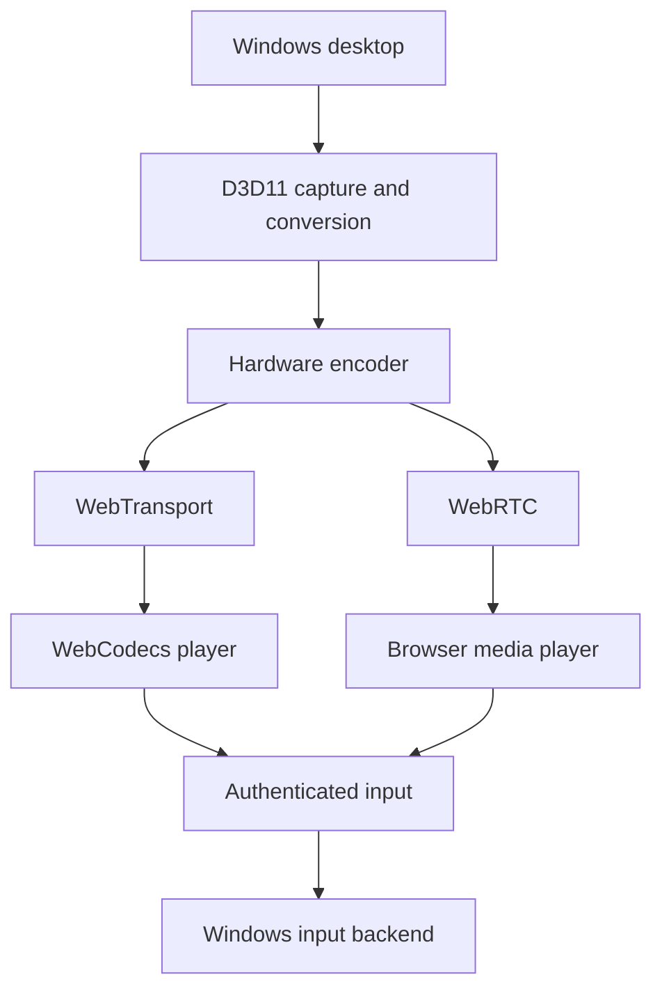

# Architecture overview

The code and ADRs describe current behavior. The original report in `docs/research`
provides design history; some transport choices have since changed.

## Data path

The same embedded web client handles pairing, the local dashboard and remote play.
HTTPS/WebSocket signaling authenticates a paired device before media setup.
Negotiated capabilities select WebTransport/WebCodecs or the WebRTC path; retain
both when modifying the client. Audio and input follow the negotiated transport.

| Module | Owns |
| --- | --- |
| `app` | Configuration, boot, shutdown, tray and lifecycle |
| `http`, `identity`, `pairing` | Web assets, origins, credentials and device access |
| `session` | One active player, ownership tickets and input release |
| `media/pipeline`, `encoder_policy` | Capture, conversion, hardware encode and codec choice |
| `media/wt` | WebTransport sessions, video/audio queues and recovery |
| `media/webrtc` | GStreamer WebRTC negotiation and media |
| `input` | Packet validation, state/watchdog and Windows backends |
| `stats`, `health` | Measurements and diagnostics |
| `web/src/ui` | Dashboard, pairing, library, settings and playback UI |

## Invariants

Authenticate before media/input; exactly one player owns the active session.
Displaced sessions must not tear down their successors. Teardown releases held
input and destroys the pipeline. Bound queues and discard stale frames. Keep
capture/conversion on the GPU; do not silently substitute a software encoder.
Adapt bitrate while preserving the player's chosen resolution and frame rate.

Browsers can impose their own presentation and input restrictions. Report
measured behavior rather than promising zero buffering or universal shortcuts.
See ADR-0011 for WebTransport and ADR-0007 for session ownership.

## Security and packaging

Administration is loopback-only with Host/origin checks. Browser credentials live
under the host's HTTPS origin. CA/host keys use per-user DPAPI protection on
Windows. Remote access is opt-in. See the LAN security model.

The EXE embeds the production Vite build. Windows PE dependencies sit beside the
EXE; plugins are under `runtime/gstreamer/lib/gstreamer-1.0`. The package smoke
check isolates PATH so an installed developer runtime cannot conceal missing DLLs.
